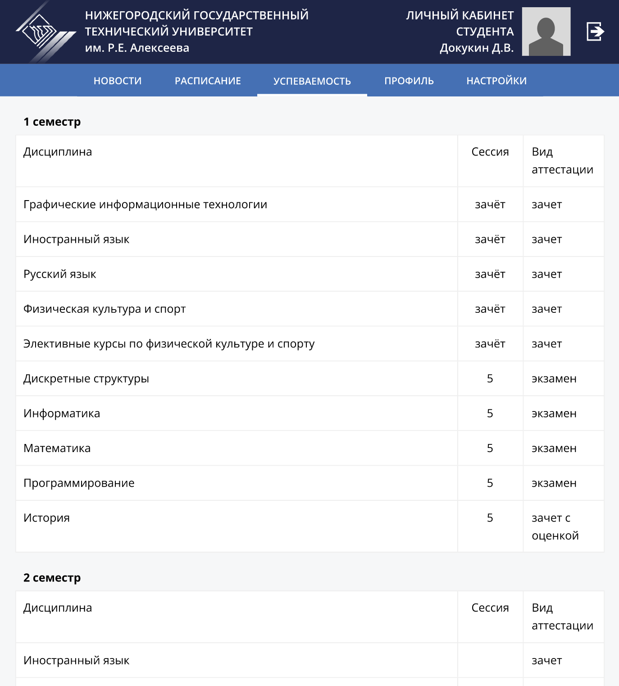

### Лабораторная работа

**Предмет**: UI дизайн

**Цель работы**: 
Разработать макет интерфейса для работы с программой (алгоритмом), с использованием инструмента Figma. 
Общие требования:
- Макет должен быть создан в соответствии с принципами хорошего дизайна и удобства использования.
- Все элементы интерфейса должны быть четко размещены и выровнены.
- Цветовая палитра и шрифты должны быть подобраны с учетом целевой аудитории и стиля сайта.
- Макет должен быть адаптивным и подходить для просмотра на различных устройствах (настольный компьютер, планшет, мобильный телефон).
- Макет должен состоять минимум из 3 экранных форм. 

**Тема**: Личный кабинет студента НГТУ

Подробности в файле "report".

#### Демонстрация

